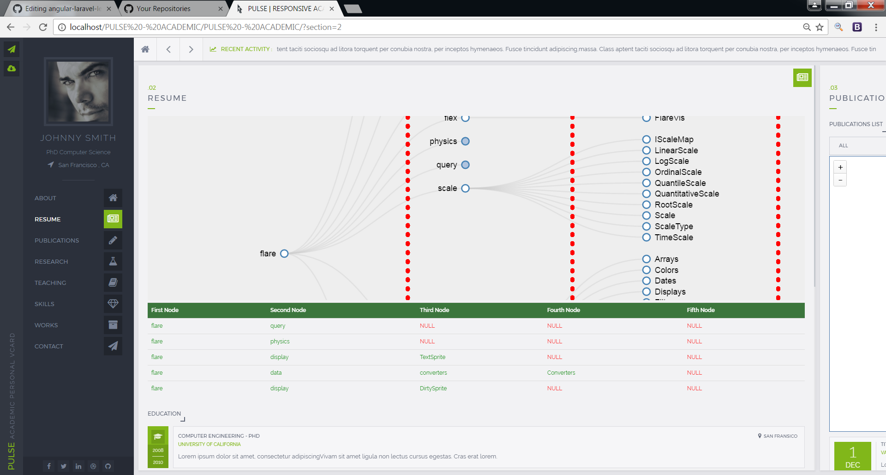
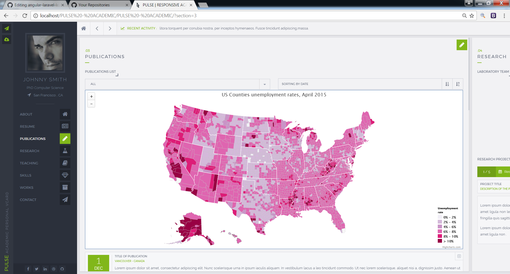
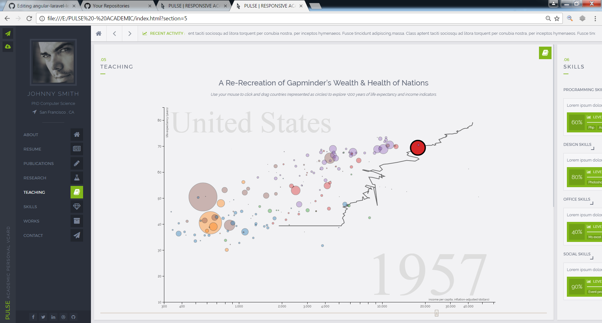
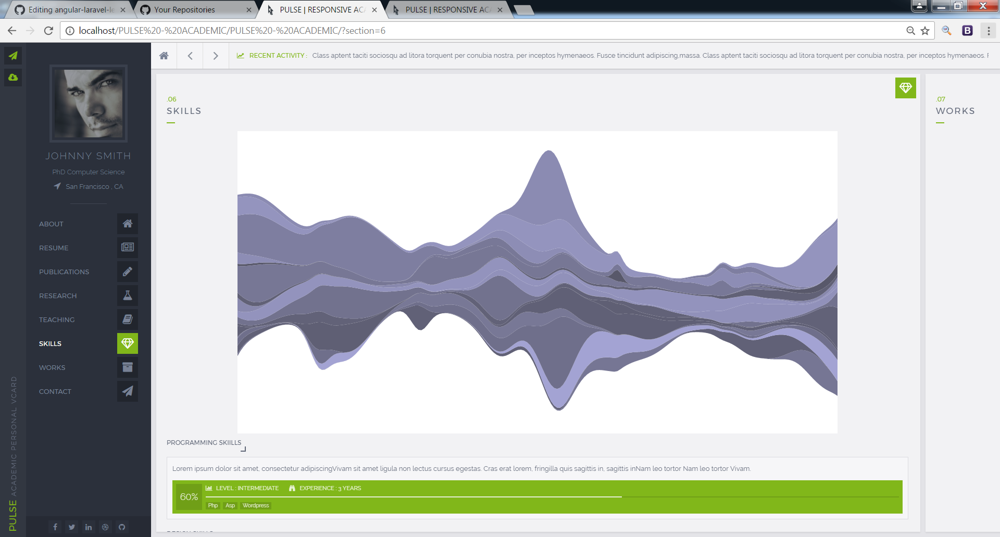
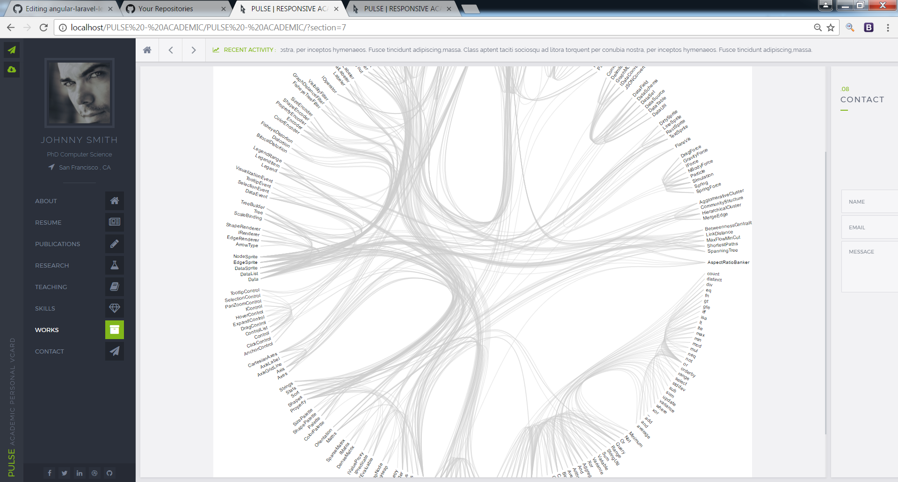

# D3 demos in Dashboard
This is a d3.js project that has different data visualization charts like Hierarchy chart, High chart, Bubble chart.
## Run
You can run this project directly using index.html. But in this case, you can't see the treechart in "RESUME" page.

If you want to see treechart, you can use WAMP or XAMPP.
## Result
1. Hierarchy chart

2. High chart

3. Bubble chart

4. Data visualization 1

5. Data visualization 2

